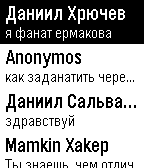
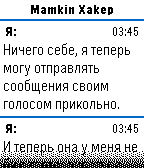
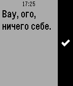

# Pebblakte
Клиент ВКонтакте для часов Pebble. Ничего лишнего.

Был изначально разработан [Кластером](https://cluster.wtf/), но был очень давно заброшен. Приложение форкнуто и исходники опубликованы с его разрешения :)

## Скриншоты

<table>
    <tbody>
        <tr>
            <td>
                
            </td>
            <td>
                
            </td>
            <td>
                
            </td>
        </tr>
    </tbody>
</table>

## Получение токена

### ВКонтакте

1. Заходим на [vkhost.github.io](vkhost.github.io)
2. Жмём на Kate Mobile
3. Разрешаем всё
4. Идём в адресную строку и копируем всё, что начинается после `access_token=` и заканчивается до `&expires_in`
5. Копируйте эту строку в конфигурацию как "Токен", а в домене прописывайте "api.vk.com"

### OpenVK и его инстанции

См. [документацию](https://docs.ovk.to/openvk_engine/ru/api/description/#_1)
